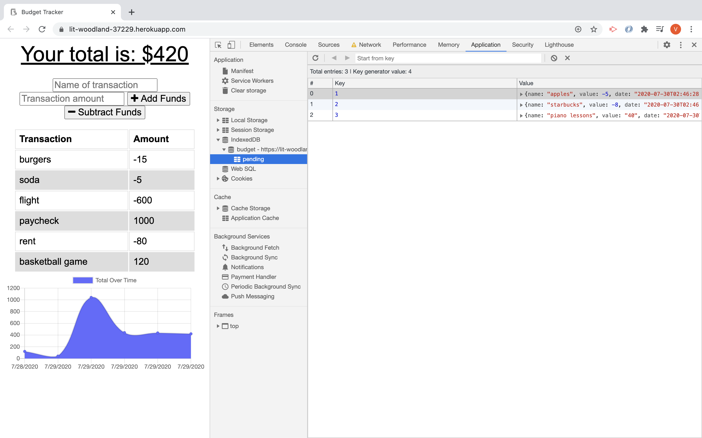

# gt-pwa-budget-tracker-hw

## Description 
An application that would make it easier an user to be able to add expenses and deposits to their budget with or without a connection to the internet. When entering transactions offline, they should populate the total when brought back online.

If you're new to Markdown, read the GitHub guide on [Mastering Markdown](https://guides.github.com/features/mastering-markdown/).

If you need an example of a good README, check out [the VSCode repository](https://github.com/microsoft/vscode).

## Table of Contents (Optional)

If your README is very long, add a table of contents to make it easy for users to find what they need.

* [Installation](#installation)
* [Usage](#usage)
* [Credits](#credits)
* [License](#license)

## Installation

Select the Heroku link to deploy the web application [Heroku](https://lit-woodland-37229.herokuapp.com/)

## Usage 

In the application the user should enter in the item, amount , and either the addtion or subtraction button to calculate the items impact on the budget 

## Credits

Completed as a independent homework assignment for Georgia Tech's Full-Flex with some items provided from to me.

## License

Copyright (c) [2020][Chay Williams]

Permission is hereby granted, free of charge, to any person obtaining a copy of this software and associated documentation files (the "Software"), to deal in the Software without restriction, including without limitation the rights to use, copy, modify, merge, publish, distribute, sublicense, and/or sell copies of the Software, and to permit persons to whom the Software is furnished to do so, subject to the following conditions:

The above copyright notice and this permission notice shall be included in all copies or substantial portions of the Software.

THE SOFTWARE IS PROVIDED "AS IS", WITHOUT WARRANTY OF ANY KIND, EXPRESS OR IMPLIED, INCLUDING BUT NOT LIMITED TO THE WARRANTIES OF MERCHANTABILITY, FITNESS FOR A PARTICULAR PURPOSE AND NONINFRINGEMENT. IN NO EVENT SHALL THE AUTHORS OR COPYRIGHT HOLDERS BE LIABLE FOR ANY CLAIM, DAMAGES OR OTHER LIABILITY, WHETHER IN AN ACTION OF CONTRACT, TORT OR OTHERWISE, ARISING FROM, OUT OF OR IN CONNECTION WITH THE SOFTWARE OR THE USE OR OTHER DEALINGS IN THE SOFTWARE.

## Contributing
Currently not accepting any contributions.

